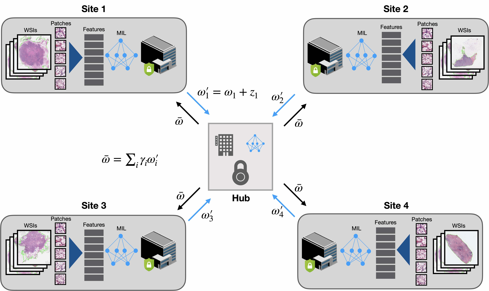

# HistoFL: A Toolbox for Feaderated Learning in Computational Pathology
***TL;DR:** Code accompanying [our paper](https://arxiv.org/abs/2004.09666) for simulating weakly-supervised classification and survival prediction on multi-institutional histopathology WSI data using federated learning*



# Preprocess/Setup
### Installation Guide for Linux (using anaconda)
[Installation Guide](https://github.com/mahmoodlab/CLAM/blob/master/docs/INSTALLATION.md)

### Data Preparation
We chose to encode each tissue patch with a 1024-dim feature vector using a truncated, pretrained ResNet50. For each WSI, these features are expected to be saved as matrices of torch tensors of size N x 1024, where N is the number of patches from each WSI (varies from slide to slide). The following folder structure is assumed:
```bash
DATA_ROOT_DIR/
    └──FEATURES_DIR/
         ├── h5_files
                ├── slide_1.h5
                ├── slide_2.h5
                └── ...
         └── pt_files
                ├── slide_1.pt
                ├── slide_2.pt
                └── ...
```
DATA_ROOT_DIR is the base directory of all datasets (e.g. the directory to your SSD). DATASET_DIR is the name of the folder containing data specific to one experiment and features from each slide is stored as .pt files.

Please refer to refer to [CLAM](https://github.com/mahmoodlab/CLAM) for examples on how perform this feature extraction step.

Results by default are saved to **./results** folder. Predictions for each sample in the test set are stored in **.pkl** files under the directory specified --exp_code (see below).

# Classification 
use main.py --h for help on list of possible commandline arguments
See the definition of args.task in **main.py** for how to setup experiments with your own dataset (currently a dummy task is provided for illustration corresponding to the csv_file **dataset_csv/classification_fl_dummy_dataset.csv** and features stored under **DATA_ROOT_DIR/classification_features_dir**).
See **splits/classification_dummy** for examples on the expected format of train/val/test splits for k-fold experiments.


### Individual Site
Selecting data from a single institution for training can be done by specifying --inst_name NAME_OF_INSTITUTE. Example command for training on data from "institute_0" is as follows:
```
CUDA_VISIBLE_DEVICES=0 python main.py --k 5 --exp_code classification_institute_0_only --weighted_sample --task classification --inst_name institute_0 --data_root_dir DATA_ROOT_DIR --split_dir classification_dummy
```

### No FL (Centralized)
Training on data on all institutions without federated learning is toggled on using the --no_fl flag. 
``` shell
CUDA_VISIBLE_DEVICES=0 python main.py --k 5 --exp_code classification_no_fl --weighted_sample --task classification --no_fl --data_root_dir DATA_ROOT_DIR --split_dir classification_dummy
```

### FL with varying noise level (Gaussian Mechanism)
Training with federated averaging can be simulated by removing the --no_fl flag, as well as providing the level of noise (alpha parameter) via --noise_level. Example with alpha = 0.001 is as follows:
``` shell
CUDA_VISIBLE_DEVICES=0,1 python main.py --k 5 --exp_code classification_noise_0.001 --weighted_sample --task classification --noise_level 0.001 --weighted_fl_avg --data_root_dir DATA_ROOT_DIR --split_dir classification_dummy
```

# Survival Prediction 
use main_surv.py --h for help on list of possible commandline arguments
See the definition of args.task in **main.py** for how to setup experiments with your own dataset (currently a dummy task is provided for illustration corresponding to the csv_file **dataset_csv/survival_fl_dummy_dataset.csv** and features stored under **DATA_ROOT_DIR/survival_features_dir**).
See **splits/survival_dummy** for examples on the expected format of train/val/test splits for k-fold experiments.

### Individual sites
Selecting data from a single institution for training can be done by specifying --inst_name NAME_OF_INSTITUTE. Example command for training on data from "institute_0" is as follows:
``` shell
CUDA_VISIBLE_DEVICES=0 python main_surv.py --k 5 --exp_code survival_institute_0_only  --task survival --inst_name institute_0 --data_root_dir DATA_ROOT_DIR --split_dir survival_dummy
```

### No FL (Centralized)
Similar to classification, training on data on all institutions without federated learning is toggled on using the --no_fl flag. 
``` shell
CUDA_VISIBLE_DEVICES=0 python main_surv.py --k 5 --exp_code survival_no_fl --task survival --no_fl --data_root_dir DATA_ROOT_DIR --split_dir survival_dummy
```
### FL with varying noise level (Gaussian Mechanism)
Training with federated averaging can be simulated by removing the --no_fl flag, as well as providing the level of noise (alpha parameter) via --noise_level. Example with alpha = 0.001 is as follows:
``` shell
CUDA_VISIBLE_DEVICES=0,1 python main_surv.py --k 5 --exp_code survival_noise_0.001 --task survival --noise_level 0.001 --weighted_fl_avg --data_root_dir DATA_ROOT_DIR --split_dir survival_dummy
```

## License
© [Mahmood Lab](http://www.mahmoodlab.org) - This code is made available under the GPLv3 License and is available for non-commercial academic purposes. 

## Reference
If you find our work useful in your research or if you use parts of this code please consider citing our paper:
```
@article{lu2020federated,
  title={Federated Learning for Computational Pathology on Gigapixel Whole Slide Images},
  author={Lu, Ming Y and Kong, Dehan and Lipkova, Jana and Chen, Richard J and Singh, Rajendra and Williamsona, Drew FK and Chena, Tiffany Y and Mahmood, Faisal},
  journal={arXiv preprint arXiv:2009.10190},
  year={2020}
}
```
